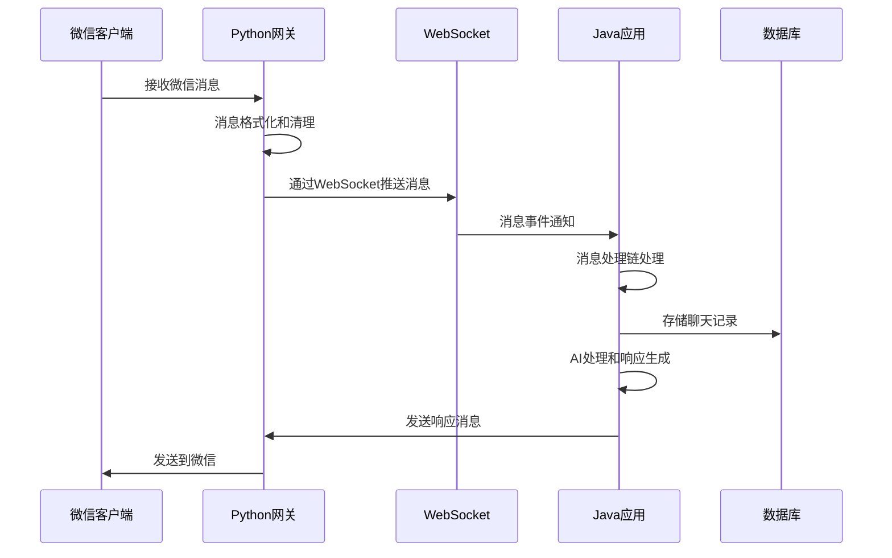
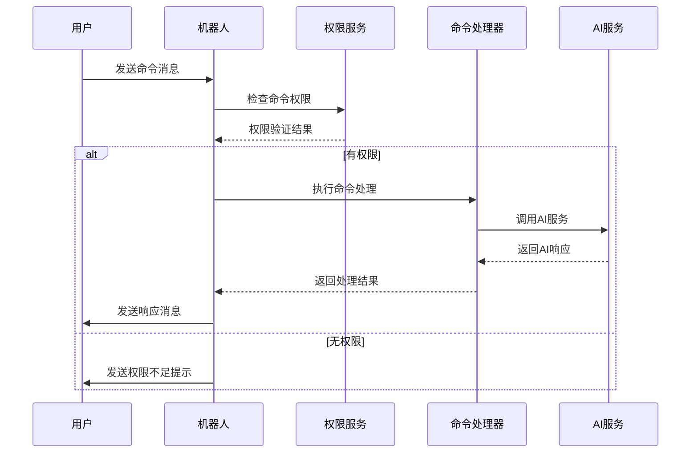

# TigerBot 项目技术文档

## 📋 目录
- [项目概述](#项目概述)
- [系统架构](#系统架构)
- [模块详解](#模块详解)
- [技术栈](#技术栈)
- [DDD架构设计](#ddd架构设计)
- [数据库设计](#数据库设计)
- [API接口](#api接口)
- [部署指南](#部署指南)
- [开发指南](#开发指南)

## 🎯 项目概述

TigerBot 是一个基于 Spring Boot 和 Spring AI 的智能微信聊天机器人系统，采用领域驱动设计(DDD)架构模式，支持多模块化开发和微服务部署。

### 核心特性
- 🤖 **智能对话**: 基于 DeepSeek 大语言模型的 AI 对话
- 🔗 **微信集成**: 通过 Python wxauto 库实现微信自动化
- 💾 **数据持久化**: PostgreSQL 数据库存储聊天记录和配置
- 🎭 **角色扮演**: 支持自定义 AI 角色和提示词
- 📊 **管理后台**: Web 管理界面控制机器人配置
- 🔐 **权限控制**: 细粒度的命令权限管理

## 🏗️ 系统架构

```
┌─────────────────────────────────────────────────────────────┐
│                    TigerBot 系统架构                          │
├─────────────────────────────────────────────────────────────┤
│  ┌─────────────────┐    ┌─────────────────┐                 │
│  │  Management     │    │   Core Module   │                 │
│  │   Module        │    │                 │                 │
│  │  (Web管理界面)   │    │  (核心业务逻辑)  │                 │
│  └─────────────────┘    └─────────────────┘                 │
│           │                       │                         │
│           └───────────┬───────────┘                         │
│                       │                                     │
│  ┌─────────────────────────────────────────────────────────┐ │
│  │              共享基础设施层                              │ │
│  │  ┌─────────────┐  ┌─────────────┐  ┌─────────────┐     │ │
│  │  │ PostgreSQL  │  │   Spring    │  │   Python    │     │ │
│  │  │  Database   │  │     AI      │  │   wxauto    │     │ │
│  │  └─────────────┘  └─────────────┘  └─────────────┘     │ │
│  └─────────────────────────────────────────────────────────┘ │
└─────────────────────────────────────────────────────────────┘
```

### 模块关系图
```
tiger-bot/
├── tiger-bot-core/          # 核心业务模块
│   ├── domain/              # 领域层
│   ├── application/         # 应用层  
│   ├── infrastructure/      # 基础设施层
│   └── interfaces/          # 接口层
├── tiger-bot-management/    # 管理模块
│   ├── controller/          # Web控制器
│   └── service/             # 管理服务
└── wxauto/                  # Python微信网关
    └── wx_http_sse_gateway.py
```

## 🔧 模块详解

### 1. tiger-bot-core (核心模块)

**职责**: 实现核心业务逻辑，包括消息处理、AI对话、权限管理等

#### 领域层 (Domain)
- **聚合根**: Chat, Command, Listener, User, Message
- **值对象**: AiSpecification
- **领域服务**: ListenerDomainService, ChatHistoryCollector
- **仓储接口**: 各实体的Repository接口

#### 应用层 (Application)
- **应用服务**: ListenerApplicationService, CommandAuthApplicationService, MessageApplicationService
- **命令处理**: Command/Query分离
- **DTO**: 数据传输对象和聚合对象

#### 基础设施层 (Infrastructure)
- **外部集成**: WxAuto微信接口实现
- **AI集成**: Spring AI集成和聊天记录收集
- **数据持久化**: Spring Data JDBC实现
- **配置管理**: Spring Boot配置

#### 接口层 (Interfaces)
- **事件监听**: 微信连接事件处理
- **上下文管理**: 消息处理上下文
- **持久化**: 数据访问层

### 2. tiger-bot-management (管理模块)

**职责**: 提供Web管理界面，控制机器人配置和状态

#### 核心组件
- **ManagementController**: 系统管理API
- **BotConfigController**: 机器人配置API  
- **ManagementService**: 管理业务逻辑

#### 功能特性
- 系统状态监控
- Python进程管理
- 配置参数管理
- 运行时控制

### 3. wxauto (Python微信网关)

**职责**: 提供微信自动化操作的HTTP/WebSocket接口

#### 核心功能
- **HTTP API**: 发送消息、文件，管理监听
- **WebSocket**: 实时消息推送
- **微信操作**: 基于wxauto库的UI自动化

## 💻 技术栈

### 后端技术
- **Java 17**: 主要开发语言
- **Spring Boot 3.4.5**: 应用框架
- **Spring AI 1.0.0**: AI集成框架
- **Spring Data JDBC**: 数据访问
- **PostgreSQL**: 关系型数据库
- **Maven**: 项目构建工具

### Python组件
- **Python 3.8+**: Python运行环境
- **FastAPI**: HTTP API框架
- **WebSocket**: 实时通信
- **wxauto**: 微信自动化库
- **asyncio**: 异步编程

### 开发工具
- **Lombok**: 减少样板代码
- **MapStruct**: 对象映射
- **SLF4J + Logback**: 日志框架

## 🏛️ DDD架构设计

### 领域模型

#### 核心聚合
1. **Chat聚合**
   - 聚合根: Chat
   - 值对象: AiSpecification
   - 职责: 管理聊天对象和AI配置

2. **Command聚合**
   - 聚合根: Command
   - 值对象: AiSpecification
   - 职责: 管理命令定义和AI配置

3. **Listener聚合**
   - 聚合根: Listener
   - 实体: ChatCommandAuth
   - 职责: 管理监听配置和权限

4. **User聚合**
   - 聚合根: User
   - 职责: 用户信息管理

5. **Message聚合**
   - 聚合根: Message
   - 职责: 消息记录管理

#### 领域服务
- **ChatHistoryCollector**: 聊天记录收集
- **ListenerDomainService**: 监听器领域逻辑

### 应用服务层
- **ListenerApplicationService**: 监听器应用逻辑
- **CommandAuthApplicationService**: 命令权限应用逻辑
- **MessageApplicationService**: 消息应用逻辑

### 基础设施层
- **Repository实现**: Spring Data JDBC
- **外部服务**: WxAuto集成
- **AI服务**: Spring AI集成

## 🗄️ 数据库设计

### 核心表结构

#### 聊天相关
```sql
-- 聊天对象表
CREATE TABLE chats (
    id BIGSERIAL PRIMARY KEY,
    name VARCHAR(255) NOT NULL,
    group_flag BOOLEAN NOT NULL,
    ai_provider_id BIGINT,
    ai_model_id BIGINT,
    ai_role_id BIGINT
);

-- 监听器表
CREATE TABLE listeners (
    id BIGSERIAL PRIMARY KEY,
    chat_id BIGINT NOT NULL,
    at_reply_enable BOOLEAN NOT NULL,
    keyword_reply_enable BOOLEAN NOT NULL,
    save_pic BOOLEAN NOT NULL,
    save_voice BOOLEAN NOT NULL,
    parse_links BOOLEAN NOT NULL,
    keyword_reply TEXT[]
);
```

#### 命令权限
```sql
-- 命令表
CREATE TABLE commands (
    id BIGSERIAL PRIMARY KEY,
    pattern VARCHAR(255) NOT NULL,
    description TEXT,
    ai_provider_id BIGINT,
    ai_model_id BIGINT,
    ai_role_id BIGINT
);

-- 命令权限表
CREATE TABLE chat_command_auths (
    id BIGSERIAL PRIMARY KEY,
    chat_id BIGINT NOT NULL,
    command_id BIGINT NOT NULL,
    user_id BIGINT -- NULL表示所有人可用
);
```

#### AI配置
```sql
-- AI提供商表
CREATE TABLE ai_providers (
    id BIGSERIAL PRIMARY KEY,
    provider_type VARCHAR(50) NOT NULL,
    provider_name VARCHAR(100) NOT NULL,
    api_key VARCHAR(500),
    base_url VARCHAR(500)
);

-- AI模型表
CREATE TABLE ai_models (
    id BIGSERIAL PRIMARY KEY,
    ai_provider_id BIGINT NOT NULL,
    model_name VARCHAR(100) NOT NULL,
    description TEXT,
    max_tokens INTEGER,
    max_output_tokens INTEGER,
    temperature DECIMAL(3,2),
    frequency_penalty DECIMAL(3,2),
    presence_penalty DECIMAL(3,2),
    top_k DECIMAL(3,2),
    top_p DECIMAL(3,2),
    reasoning_flg BOOLEAN,
    stream_flg BOOLEAN,
    enabled BOOLEAN,
    tool_call_flg BOOLEAN
);

-- AI角色表
CREATE TABLE ai_roles (
    id BIGSERIAL PRIMARY KEY,
    name VARCHAR(100) NOT NULL,
    prompt_content TEXT,
    extra_memory TEXT,
    prompt_type VARCHAR(50)
);
```

## 🔌 API接口

### HTTP API (端口8000)

#### 消息发送
- `POST /api/send_text_message` - 发送文本消息
- `POST /api/send_file_by_path` - 发送本地文件
- `POST /api/send_file_by_upload` - 上传并发送文件
- `POST /api/send_file_by_url` - 从URL下载并发送文件

#### 监听管理
- `POST /api/add_listen_chat` - 添加监听对象
- `GET /api/get_robot_name` - 获取机器人名称

#### 聊天控制
- `POST /api/chat_with` - 切换聊天窗口
- `POST /api/voice_call` - 发起语音通话

### WebSocket API (端口8765)

#### 事件类型
- `connected` - 连接成功
- `heartbeat` - 心跳检测
- `wechat_messages` - 微信消息推送
- `ping/pong` - 客户端心跳

### 管理API (端口8080)

#### 系统管理
- `GET /management/status` - 系统状态
- `POST /management/start-python` - 启动Python进程
- `POST /management/stop-python` - 停止Python进程

#### 配置管理
- `GET /config/listeners` - 获取监听器配置
- `POST /config/listeners` - 创建监听器
- `GET /config/commands` - 获取命令配置

## 🚀 部署指南

### 环境要求
- Java 17+
- Python 3.8+
- PostgreSQL 12+
- 微信PC客户端

### 配置文件
```yaml
# application.yml
server:
  port: 8080

spring:
  datasource:
    url: jdbc:postgresql://localhost:5432/tigerbot
    username: your_username
    password: your_password

chatbot:
  wx-auto-gateway-http-url: http://localhost:8000
  wx-auto-gateway-ws-url: ws://localhost:8765
  chatLogApiUrl: http://localhost:5030
```

### 启动步骤
1. **启动数据库**
   ```bash
   # 启动PostgreSQL服务
   sudo systemctl start postgresql
   ```

2. **安装Python依赖**
   ```bash
   pip install -r requirements.txt
   ```

3. **启动微信网关**
   ```bash
   python wxauto/wx_http_sse_gateway.py
   ```

4. **启动Java应用**
   ```bash
   # 核心模块
   cd tiger-bot-core
   mvn spring-boot:run
   
   # 管理模块
   cd tiger-bot-management  
   mvn spring-boot:run
   ```

## 👨‍💻 开发指南

### 代码结构规范
- 遵循DDD架构分层
- 使用Record类定义实体和值对象
- 应用服务负责业务编排
- 基础设施层处理外部依赖

### 开发流程
1. **领域建模**: 定义聚合根和实体
2. **应用服务**: 实现业务用例
3. **基础设施**: 实现技术细节
4. **接口层**: 暴露API接口

### 测试策略
- 单元测试: 领域逻辑测试
- 集成测试: 应用服务测试
- 端到端测试: API接口测试

## 📁 详细目录结构

```
tiger-bot/
├── pom.xml                                    # 父级Maven配置
├── README.md                                  # 项目说明文档
├── requirements.txt                           # Python依赖
├── LICENSE                                    # 开源协议
├── TECHNICAL_DOCUMENTATION.md                 # 技术文档
│
├── tiger-bot-core/                           # 核心业务模块
│   ├── pom.xml                               # 核心模块Maven配置
│   └── src/main/java/com/fffattiger/wechatbot/
│       ├── TigerBotCoreApplication.java      # 核心模块启动类
│       │
│       ├── domain/                           # 领域层
│       │   ├── ai/                          # AI领域对象
│       │   │   ├── AiProvider.java          # AI提供商实体
│       │   │   ├── AiModel.java             # AI模型实体
│       │   │   ├── AiRole.java              # AI角色实体
│       │   │   └── service/                 # AI领域服务
│       │   │       └── ChatHistoryCollector.java
│       │   ├── chat/                        # 聊天领域对象
│       │   │   ├── Chat.java                # 聊天聚合根
│       │   │   └── repository/              # 聊天仓储接口
│       │   │       └── ChatRepository.java
│       │   ├── command/                     # 命令领域对象
│       │   │   ├── Command.java             # 命令聚合根
│       │   │   └── repository/              # 命令仓储接口
│       │   │       └── CommandRepository.java
│       │   ├── listener/                    # 监听器领域对象
│       │   │   ├── Listener.java            # 监听器聚合根
│       │   │   ├── ChatCommandAuth.java     # 命令权限实体
│       │   │   ├── service/                 # 监听器领域服务
│       │   │   │   └── ListenerDomainService.java
│       │   │   └── repository/              # 监听器仓储接口
│       │   │       ├── ListenerRepository.java
│       │   │       └── ChatCommandAuthRepository.java
│       │   ├── message/                     # 消息领域对象
│       │   │   ├── Message.java             # 消息聚合根
│       │   │   └── repository/              # 消息仓储接口
│       │   │       └── MessageRepository.java
│       │   ├── user/                        # 用户领域对象
│       │   │   ├── User.java                # 用户聚合根
│       │   │   └── repository/              # 用户仓储接口
│       │   │       └── UserRepository.java
│       │   └── shared/                      # 共享领域对象
│       │       └── valueobject/             # 值对象
│       │           └── AiSpecification.java # AI规格值对象
│       │
│       ├── application/                     # 应用层
│       │   ├── service/                     # 应用服务
│       │   │   ├── ListenerApplicationService.java      # 监听器应用服务
│       │   │   ├── CommandAuthApplicationService.java   # 命令权限应用服务
│       │   │   └── MessageApplicationService.java       # 消息应用服务
│       │   ├── dto/                         # 数据传输对象
│       │   │   └── ListenerAggregate.java   # 监听器聚合DTO
│       │   ├── assembler/                   # 对象装配器
│       │   │   └── MessageAssembler.java    # 消息装配器
│       │   ├── command/                     # 命令对象
│       │   ├── query/                       # 查询对象
│       │   └── handler/                     # 处理器
│       │
│       ├── infrastructure/                  # 基础设施层
│       │   ├── config/                      # 配置类
│       │   │   └── ChatBotConfiguration.java # 聊天机器人配置
│       │   ├── external/                    # 外部服务集成
│       │   │   └── wchat/                   # 微信集成
│       │   │       ├── WxAuto.java          # 微信自动化接口
│       │   │       ├── WxAutoWebSocketHttpClient.java # 微信客户端实现
│       │   │       └── MessageHandler.java  # 消息处理器
│       │   ├── ai/                          # AI集成
│       │   │   ├── AsyncJdbcChatHistoryCollector.java # 异步聊天记录收集器
│       │   │   └── JsonChatMemoryRepository.java      # JSON聊天记忆仓储
│       │   ├── event/                       # 事件处理
│       │   └── messaging/                   # 消息传递
│       │
│       ├── interfaces/                      # 接口层
│       │   ├── event/                       # 事件监听器
│       │   │   └── WxAutoConnectedListener.java # 微信连接事件监听器
│       │   ├── context/                     # 上下文管理
│       │   └── persistence/                 # 持久化接口
│       │
│       └── shared/                          # 共享组件
│           ├── event/                       # 共享事件
│           ├── properties/                  # 配置属性
│           ├── role/                        # 角色相关
│           ├── util/                        # 工具类
│           └── valueobject/                 # 共享值对象
│
├── tiger-bot-management/                    # 管理模块
│   ├── pom.xml                             # 管理模块Maven配置
│   └── src/main/java/com/fffattiger/wechatbot/management/
│       ├── TigerBotManagementApplication.java # 管理模块启动类
│       ├── controller/                      # Web控制器
│       │   ├── ManagementController.java    # 管理控制器
│       │   └── BotConfigController.java     # 机器人配置控制器
│       └── service/                         # 管理服务
│           └── ManagementService.java       # 管理业务服务
│
└── wxauto/                                 # Python微信网关
    ├── wx_http_sse_gateway.py              # 微信HTTP/WebSocket网关
    └── API_DOCUMENTATION_WX_GATEWAY.md     # 网关API文档
```

## 🔄 消息处理流程

### 消息接收流程


### 详细消息处理架构

#### 事件驱动架构
系统采用Spring事件驱动架构处理微信消息：

1. **MessageReceiveEvent**: 消息接收事件
2. **MessageReceiveListener**: 消息接收监听器
3. **MessageHandlerChain**: 责任链模式的消息处理器链
4. **各种MessageHandler**: 具体的消息处理器实现

#### 核心组件详解

##### 1. MessageReceiveListener (消息接收监听器)
<augment_code_snippet path="tiger-bot-core/src/main/java/com/fffattiger/wechatbot/interfaces/event/MessageReceiveListener.java" mode="EXCERPT">
````java
@Component
public class MessageReceiveListener implements ApplicationListener<MessageReceiveEvent> {

    @Override
    public void onApplicationEvent(@NonNull MessageReceiveEvent event) {
        // 处理微信消息
        for (BatchedSanitizedWechatMessages.Chat chat : event.getMessage().data()) {
            ListenerAggregate listenerAggregate = listenerApplicationService.getListenerAggregate(chat.chatName());
            if (listenerAggregate == null) {
                log.warn("未监听该对象: {}", chat.chatName());
                continue;
            }

            for (BatchedSanitizedWechatMessages.Chat.Message msg : chat.messages()) {
                messageProcessorPool.submit(() -> {
                    DefaultMessageHandlerContext context = new DefaultMessageHandlerContext();
                    context.setMessage(msg);
                    context.setWxAuto(event.getWxAuto());
                    context.setCurrentChat(listenerAggregate);
                    context.setChatBotProperties(chatBotProperties);
                    context.setMessageTimestamp(event.getMessage().timestamp());
                    new DefaultMessageHandlerChain(messageHandlers).handle(context);
                });
            }
        }
    }
}
````
</augment_code_snippet>

**特点**:
- 异步处理消息，使用线程池避免阻塞
- 检查监听器配置，只处理已配置的聊天对象
- 为每个消息创建处理上下文
- 启动消息处理器链

##### 2. DefaultMessageHandlerChain (消息处理器链)
<augment_code_snippet path="tiger-bot-core/src/main/java/com/fffattiger/wechatbot/interfaces/event/handlers/DefaultMessageHandlerChain.java" mode="EXCERPT">
````java
public class DefaultMessageHandlerChain implements MessageHandlerChain {

    private final List<MessageHandler> handlers;
    private Iterator<MessageHandler> iterator;

    @Override
    public boolean handle(MessageHandlerContext context) {
        if (iterator.hasNext()) {
            MessageHandler nextHandler = iterator.next();
            try {
                log.info("处理消息, handler: {}", nextHandler.getClass().getSimpleName());
                return nextHandler.handle(context, this);
            } catch (Exception e) {
                log.error("处理消息失败, handler: {}", nextHandler.getClass().getSimpleName(), e);
                return false;
            }
        }
        return false;
    }
}
````
</augment_code_snippet>

**特点**:
- 责任链模式实现
- 按顺序执行处理器
- 异常隔离，单个处理器失败不影响整体
- 支持处理器优先级排序

#### 消息处理器类型

##### 1. HistoryCollectorMessageHandler (历史记录收集器)
<augment_code_snippet path="tiger-bot-core/src/main/java/com/fffattiger/wechatbot/interfaces/event/handlers/HistoryCollectorMessageHandler.java" mode="EXCERPT">
````java
@Service
public class HistoryCollectorMessageHandler implements MessageHandler {

    @Override
    public boolean handle(MessageHandlerContext context, MessageHandlerChain chain) {
        Message message = context.message();
        String chatName = context.currentChat().chat().name();

        chatHistoryCollector.collect(chatName, message, context.messageTimestamp());

        return chain.handle(context);
    }

    @Override
    public int getOrder() {
        return -50; // 高优先级，优先收集历史记录
    }
}
````
</augment_code_snippet>

**职责**: 收集所有消息到数据库，用于AI上下文和聊天记录查询

##### 2. GroupMessageHandler (群聊消息处理器)
<augment_code_snippet path="tiger-bot-core/src/main/java/com/fffattiger/wechatbot/interfaces/event/handlers/GroupMessageHandler.java" mode="EXCERPT">
````java
@Override
public boolean handle(MessageHandlerContext context, MessageHandlerChain chain) {
    ListenerAggregate chat = context.currentChat();
    BatchedSanitizedWechatMessages.Chat.Message message = context.message();
    String content = message.content();

    if (!chat.chat().groupFlag()) {
        context.setCleanContent(content);
        return chain.handle(context);
    }

    if (chat.listener().atReplyEnable() && !content.startsWith("@" + context.chatBotProperties().getRobotName())) {
        log.info("已开启@回复，未匹配到@回复，跳过");
        return false;
    }

    if (chat.listener().atReplyEnable()) {
        content = extractNoneAtContent(context, content);
    }
    // ...
}
````
</augment_code_snippet>

**职责**:
- 区分群聊和私聊消息
- 处理@回复逻辑
- 清理消息内容（去除@符号等）

##### 3. AiChatMessageHandler (AI对话处理器)
<augment_code_snippet path="tiger-bot-core/src/main/java/com/fffattiger/wechatbot/interfaces/event/handlers/AiChatMessageHandler.java" mode="EXCERPT">
````java
@Override
public boolean handle(MessageHandlerContext context, MessageHandlerChain chain) {
    String cleanContent = context.cleanContent();
    BatchedSanitizedWechatMessages.Chat.Message message = context.message();
    ListenerAggregate chat = context.currentChat();

    if (message == null || message.type() == null || !message.type().equals(MessageType.FRIEND)
            || !StringUtils.hasLength(cleanContent)) {
        return chain.handle(context);
    }

    Map<String, Object> params = new HashMap<>();
    params.put("chatType", chat.chat().groupFlag() ? "群聊" : "私聊");

    String content = chat(context, cleanContent, message, chat, params);

    if (!StringUtils.hasLength(content)) {
        context.wx().sendText(chat.chat().name(), "繁忙， 请稍后再试");
        return false;
    }
    // ...
}
````
</augment_code_snippet>

**职责**:
- 调用AI服务生成回复
- 管理聊天上下文和记忆
- 处理AI响应异常

#### 命令处理器系统

系统实现了完整的命令处理框架，支持扩展和权限控制：

##### 1. AbstractCommandMessageHandler (抽象命令处理器)
<augment_code_snippet path="tiger-bot-core/src/main/java/com/fffattiger/wechatbot/interfaces/event/handlers/cmd/AbstractCommandMessageHandler.java" mode="EXCERPT">
````java
public abstract class AbstractCommandMessageHandler implements MessageHandler {

    private final AntPathMatcher antPathMatcher = new AntPathMatcher();

    @Override
    public boolean handle(MessageHandlerContext context, MessageHandlerChain chain) {
        BatchedSanitizedWechatMessages.Chat.Message message = context.message();
        String sender = message.sender();
        String cleanContent = context.cleanContent();
        String commandPrefix = context.chatBotProperties().getCommandPrefix();

        if (message.type() == null || !message.type().equals(MessageType.FRIEND)
                || !StringUtils.hasLength(cleanContent)
                || !cleanContent.startsWith(commandPrefix)) {
            return chain.handle(context);
        }
        // 权限检查和命令执行逻辑...
    }

    public abstract boolean canHandle(String command);
    public abstract void doHandle(String command, String[] args, MessageHandlerContext context);
    public abstract String description();
}
````
</augment_code_snippet>

**特点**:
- 统一的命令格式检查
- 权限验证机制
- 支持Ant路径匹配模式
- 抽象方法定义命令处理接口

##### 2. 具体命令处理器实现

###### HelpCommandMessageHandler (帮助命令)
<augment_code_snippet path="tiger-bot-core/src/main/java/com/fffattiger/wechatbot/interfaces/event/handlers/cmd/HelpCommandMessageHandler.java" mode="EXCERPT">
````java
@Service
public class HelpCommandMessageHandler extends AbstractCommandMessageHandler {

    @Resource
    private List<AbstractCommandMessageHandler> messageHandlers;

    @Override
    public boolean canHandle(String command) {
        return command.startsWith("/help") || command.startsWith("/h")
            || command.startsWith("/?") || command.startsWith("/帮助");
    }

    @Override
    public void doHandle(String command, String[] args, MessageHandlerContext context) {
        String help = messageHandlers.stream()
            .map(AbstractCommandMessageHandler::description)
            .collect(Collectors.joining("\n"));
        context.wx().sendText(context.currentChat().chat().name(), help);
    }

    @Override
    public String description() {
        return "/help 查看帮助";
    }
}
````
</augment_code_snippet>

###### ChatSummaryCommandMessageHandler (聊天总结命令)
<augment_code_snippet path="tiger-bot-core/src/main/java/com/fffattiger/wechatbot/interfaces/event/handlers/cmd/ChatSummaryCommandMessageHandler.java" mode="EXCERPT">
````java
@Override
public void doHandle(String command, String[] args, MessageHandlerContext context) {
    String chatName = context.currentChat().chat().name();
    String summaryTargetChatName = args.length > 1 ? args[1] : chatName;
    String dateStr = args.length > 0 ? args[0] : "今天";

    String chatLog = chatLogClient.getChatHistory(summaryTargetChatName, dateStr, null);
    if (!StringUtils.hasLength(chatLog)) {
        log.error("没有找到聊天记录: {}", summaryTargetChatName);
        context.wx().sendText(chatName, "没有找到聊天记录");
        return;
    }

    context.wx().sendText(chatName, "总结中");
    AiSpecification aiSpecification = commandRepository.findByPattern("/总结").aiSpecification();
    String aiSummary = chat(chatLog, aiSpecification);

    if (!StringUtils.hasLength(aiSummary)) {
        context.wx().sendText(chatName, "服务繁忙，稍后再试");
        return;
    }

    // 渲染为图片并发送
    File outputFile = renderImageFile(context, aiSummary, summaryTargetChatName);
    context.wx().sendFileByUpload(chatName, outputFile);
}
````
</augment_code_snippet>

**功能**:
- 获取指定日期的聊天记录
- 调用AI进行内容总结
- 将总结结果渲染为图片发送

##### 3. 其他命令处理器

- **AddListenerCommandMessageHandler**: 添加监听器命令
- **ChangeRoleCommandMessageHandler**: 切换AI角色命令
- **StatusCommandMessageHandler**: 查看系统状态命令

#### 消息处理器优先级

系统通过`getOrder()`方法控制处理器执行顺序：

```java
// 优先级示例 (数值越小优先级越高)
HistoryCollectorMessageHandler: -50    // 最高优先级，先收集历史
GroupMessageHandler: 0                 // 默认优先级，处理群聊逻辑
CommandHandlers: 10                    // 命令处理器
AiChatMessageHandler: 100              // 最低优先级，AI对话兜底
```

#### 消息处理上下文

**MessageHandlerContext** 提供处理器间的数据共享：

```java
public interface MessageHandlerContext {
    BatchedSanitizedWechatMessages.Chat.Message message();
    WxAuto wx();
    ListenerAggregate currentChat();
    ChatBotProperties chatBotProperties();
    Long messageTimestamp();
    String cleanContent();
    void setCleanContent(String cleanContent);
}
```

**包含信息**:
- 原始消息对象
- 微信操作接口
- 当前聊天配置
- 系统配置属性
- 消息时间戳
- 清理后的消息内容

### 命令处理流程


## 🔐 权限管理机制

### 权限模型
- **三级权限控制**: 聊天对象 → 命令 → 用户
- **全局权限**: userId为null表示所有人可用
- **特定用户权限**: 指定特定用户可使用命令
- **权限继承**: 支持权限的层级继承

### 权限检查逻辑
```java
public boolean hasPermission(Long chatId, Long commandId, Long userId) {
    List<ChatCommandAuth> auths = chatCommandAuthRepository
        .findByChatIdAndCommandId(chatId, commandId);

    // 无权限配置默认拒绝
    if (auths.isEmpty()) return false;

    // 检查全局权限
    boolean hasGlobalPermission = auths.stream()
        .anyMatch(auth -> auth.userId() == null);
    if (hasGlobalPermission) return true;

    // 检查特定用户权限
    return auths.stream()
        .anyMatch(auth -> userId.equals(auth.userId()));
}
```

## 🤖 AI集成架构

### Spring AI集成
- **多模型支持**: 支持不同AI提供商和模型
- **角色系统**: 可配置的AI角色和提示词
- **记忆管理**: 聊天上下文和历史记录
- **流式响应**: 支持流式AI响应

### AI配置层次
```
AiProvider (提供商)
    ├── AiModel (模型配置)
    └── AiRole (角色定义)
            └── AiSpecification (具体规格)
```

## 🔧 配置管理

### 核心配置项
```yaml
chatbot:
  # 微信网关配置
  wx-auto-gateway-http-url: http://localhost:8000
  wx-auto-gateway-ws-url: ws://localhost:8765

  # 聊天记录API
  chatLogApiUrl: http://localhost:5030

  # 超时配置
  httpTimeout: PT30S

  # 机器人名称(运行时设置)
  robotName: ${ROBOT_NAME:}
```

### 数据库配置
```yaml
spring:
  datasource:
    url: jdbc:postgresql://localhost:5432/tigerbot
    username: ${DB_USERNAME:admin}
    password: ${DB_PASSWORD:123}
    driver-class-name: org.postgresql.Driver

  sql:
    init:
      mode: always
      platform: postgresql
      schema-locations: classpath:scripts/schema-postgresql.sql
      data-locations: classpath:scripts/data.sql
```

## 🚨 错误处理和监控

### 异常处理策略
- **领域异常**: 业务规则违反异常
- **基础设施异常**: 外部服务调用异常
- **应用异常**: 应用层业务异常
- **全局异常处理**: 统一异常响应格式

### 日志管理
```yaml
logging:
  level:
    '[com.fffattiger.wechatbot]': DEBUG
    '[org.springframework.ai]': INFO
    '[org.springframework.web]': INFO
```

### 健康检查
- **微信连接状态**: 检查Python网关连接
- **数据库连接**: 检查PostgreSQL连接
- **AI服务状态**: 检查AI模型可用性
- **系统资源**: 内存、CPU使用情况

## 🔄 扩展开发指南

### 添加新的AI提供商
1. **实现AI接口**: 继承Spring AI的ChatModel接口
2. **配置管理**: 在AiProvider表中添加新提供商配置
3. **模型注册**: 在AiModel表中注册支持的模型
4. **集成测试**: 编写集成测试验证功能

### 添加新的命令处理器
1. **定义命令**: 在Command表中添加命令定义
2. **实现处理器**: 创建命令处理器类
3. **权限配置**: 在ChatCommandAuth表中配置权限
4. **注册路由**: 在消息处理链中注册新命令

### 自定义消息处理器
```java
@Component
public class CustomMessageHandler implements MessageHandler {

    @Override
    public boolean canHandle(MessageContext context) {
        // 判断是否能处理该消息
        return context.getMessage().getContent().startsWith("/custom");
    }

    @Override
    public void handle(MessageContext context) {
        // 处理消息逻辑
        String response = processCustomCommand(context.getMessage());
        context.reply(response);
    }
}
```

## 📊 性能优化建议

### 数据库优化
- **索引策略**: 为常用查询字段添加索引
- **连接池**: 配置合适的数据库连接池大小
- **查询优化**: 使用分页查询避免大量数据加载
- **缓存策略**: 对热点数据使用Redis缓存

### 内存管理
- **对象池**: 重用消息处理对象
- **异步处理**: 使用异步方式处理耗时操作
- **垃圾回收**: 调优JVM垃圾回收参数
- **资源释放**: 及时释放文件和网络资源

### 并发处理
```java
@Configuration
public class AsyncConfig {

    @Bean
    public ExecutorService messageProcessorExecutor() {
        return Executors.newFixedThreadPool(
            Runtime.getRuntime().availableProcessors() * 2
        );
    }
}
```

## 🔒 安全考虑

### 数据安全
- **敏感信息加密**: API密钥等敏感信息加密存储
- **SQL注入防护**: 使用参数化查询
- **输入验证**: 严格验证用户输入
- **访问控制**: 实现细粒度的权限控制

### 网络安全
- **HTTPS**: 生产环境使用HTTPS
- **防火墙**: 配置适当的防火墙规则
- **限流**: 实现API调用限流
- **监控**: 监控异常访问模式

## 🐛 故障排查指南

### 常见问题

#### 1. 微信连接失败
**症状**: WebSocket连接失败，无法接收消息
**排查步骤**:
1. 检查微信PC客户端是否登录
2. 验证Python网关是否正常运行
3. 检查网络连接和端口占用
4. 查看Python网关日志

#### 2. AI响应异常
**症状**: AI不响应或响应错误
**排查步骤**:
1. 检查AI提供商API密钥
2. 验证网络连接到AI服务
3. 检查AI模型配置参数
4. 查看应用日志中的AI调用记录

#### 3. 数据库连接问题
**症状**: 应用启动失败或数据操作异常
**排查步骤**:
1. 检查数据库服务状态
2. 验证连接字符串和凭据
3. 检查数据库权限设置
4. 查看数据库连接池状态

### 日志分析
```bash
# 查看应用日志
tail -f logs/application.log

# 查看Python网关日志
tail -f wxauto/gateway.log

# 查看数据库日志
tail -f /var/log/postgresql/postgresql.log
```

## 📈 监控和运维

### 应用监控
- **Spring Boot Actuator**: 健康检查和指标监控
- **Micrometer**: 应用指标收集
- **日志聚合**: 使用ELK Stack收集和分析日志
- **告警机制**: 配置关键指标告警

### 系统监控
```yaml
# application.yml
management:
  endpoints:
    web:
      exposure:
        include: health,info,metrics,prometheus
  endpoint:
    health:
      show-details: always
```

### 备份策略
- **数据库备份**: 定期备份PostgreSQL数据
- **配置备份**: 备份应用配置文件
- **日志归档**: 定期归档历史日志
- **代码版本**: 使用Git管理代码版本

## 🚀 部署最佳实践

### Docker化部署
```dockerfile
# Dockerfile
FROM openjdk:17-jdk-slim

COPY target/tiger-bot-core.jar app.jar
COPY wxauto/ /app/wxauto/

EXPOSE 8080

ENTRYPOINT ["java", "-jar", "/app.jar"]
```

### Docker Compose
```yaml
version: '3.8'
services:
  postgres:
    image: postgres:13
    environment:
      POSTGRES_DB: tigerbot
      POSTGRES_USER: admin
      POSTGRES_PASSWORD: 123
    ports:
      - "5432:5432"

  tiger-bot:
    build: .
    ports:
      - "8080:8080"
    depends_on:
      - postgres
    environment:
      SPRING_DATASOURCE_URL: jdbc:postgresql://postgres:5432/tigerbot
```

### 生产环境配置
```yaml
# application-prod.yml
spring:
  profiles:
    active: prod
  datasource:
    hikari:
      maximum-pool-size: 20
      minimum-idle: 5
      connection-timeout: 30000

logging:
  level:
    root: INFO
    '[com.fffattiger.wechatbot]': INFO
  file:
    name: logs/tiger-bot.log
```

## 📚 参考资料

### 技术文档
- [Spring Boot官方文档](https://spring.io/projects/spring-boot)
- [Spring AI文档](https://docs.spring.io/spring-ai/reference/)
- [PostgreSQL文档](https://www.postgresql.org/docs/)
- [wxauto库文档](https://github.com/cluic/wxauto)

### 架构参考
- [领域驱动设计(DDD)](https://domainlanguage.com/ddd/)
- [微服务架构模式](https://microservices.io/)
- [事件驱动架构](https://martinfowler.com/articles/201701-event-driven.html)

### 开发工具
- [Maven官方文档](https://maven.apache.org/guides/)
- [Docker官方文档](https://docs.docker.com/)
- [Git版本控制](https://git-scm.com/doc)

---

*文档版本: v1.0*
*最后更新: 2024年12月*
*维护者: TigerBot开发团队*
